# 📚 Skills

- Back-End:
  - **Java**, **Spring Cloud**, Spring Boot, Spring MVC, Spring Batch, Struts2, Struts, JSP, **JPA**, **MyBatis**, Hibernate, Quartz  
  - Python, FastAPI, Flask, SQLAlchemy, poetry, pandas
- Front-End: javascript, **typescript**, **React**, Vue, jQuery, ExtJS, CSS, LESS, NextJS, EChart, Leaflet, Material UI, Ant Design
- Data Engineering: **SQL**, PL/SQL, **PostgreSQL**, **Oracle**, **MySQL**, MariaDB, MSSQL, Sybase, **MongoDB**, **Redis**, **Elasticsearch**, **BigQuery**, Hadoop, Hive, Kafka, RabbitMQ
- DevOps: **GCP**, AWS, **Kubernetes**, **Docker**, **GKE**, **Helm**, **Skaffold**
- CI/CD: **Github Actions**, **ArgoCD**, Tekton, Jenkins, Concourse CI, Continuum, Maven, Nexus, Ant
- Version Control: **Git**, Github, GitLab, bitbucket, SVN, CVS
- Tool/Etc: shell script, **Datadog**, **Locust**, Kibana, Jupyter Notebook, Airflow, SonarQube

## 기술 스킬 수준

### 백엔드
- Java       : 🟥🟥🟥🟥🟥🟥🟥🟥🟥🟥 95%
- Spring     : 🟥🟥🟥🟥🟥🟥🟥🟥🟥⬜ 90%
- JPA        : 🟥🟥🟥🟥🟥🟥🟥🟥⬜⬜ 80%
- Python     : 🟥🟥🟥🟥🟥🟥🟥⬜⬜⬜ 70%
- FastAPI    : 🟥🟥🟥🟥🟥🟥⬜⬜⬜⬜ 60%

### 프론트엔드
- JavaScript : 🟨🟨🟨🟨🟨🟨🟨⬜⬜⬜ 70%
- TypeScript : 🟨🟨🟨🟨🟨🟨⬜⬜⬜⬜ 60%
- React      : 🟨🟨🟨🟨🟨⬜⬜⬜⬜⬜ 50%
- NextJS     : 🟨🟨🟨🟨⬜⬜⬜⬜⬜⬜ 40%

### 데이터베이스
- MySQL      : 🟦🟦🟦🟦🟦🟦🟦🟦⬜⬜ 80%
- PostgreSQL : 🟦🟦🟦🟦🟦🟦🟦🟦⬜⬜ 80%
- Redis      : 🟦🟦🟦🟦🟦🟦🟦⬜⬜⬜ 70%
- MongoDB    : 🟦🟦🟦🟦🟦🟦⬜⬜⬜⬜ 60%
- Elasticsearch: 🟦🟦🟦🟦🟦🟦⬜⬜⬜⬜ 60%

### 인프라/DevOps
- Docker     : 🟩🟩🟩🟩🟩🟩🟩⬜⬜⬜ 70%
- Kubernetes : 🟩🟩🟩🟩🟩🟩⬜⬜⬜⬜ 60%
- GCP        : 🟩🟩🟩🟩🟩🟩⬜⬜⬜⬜ 60%
- Kafka      : 🟩🟩🟩🟩🟩⬜⬜⬜⬜⬜ 50%
- CI/CD      : 🟩🟩🟩🟩🟩🟩🟩⬜⬜⬜ 70%

```mermaid
%%{init: {'theme': 'neutral' }}%%
gantt
    title 기술 스킬 수준
    dateFormat X
    axisFormat %s%%
    
    section 백엔드
    Java        :done, 0, 95
    Spring      :done, 0, 90
    JPA         :done, 0, 80
    Python      :done, 0, 70
    FastAPI     :done, 0, 60
    
    section 프론트엔드
    JavaScript  :done, 0, 70
    TypeScript  :done, 0, 60
    React       :done, 0, 50
    NextJS      :done, 0, 40
    
    section 데이터베이스
    MySQL       :done, 0, 80
    PostgreSQL  :done, 0, 80
    Redis       :done, 0, 70
    MongoDB     :done, 0, 60
    Elasticsearch :done, 0, 60
    
    section 인프라/DevOps
    Docker      :done, 0, 70
    Kubernetes  :done, 0, 60
    GCP         :done, 0, 60
    Kafka       :done, 0, 50
    CI/CD       :done, 0, 70
```

