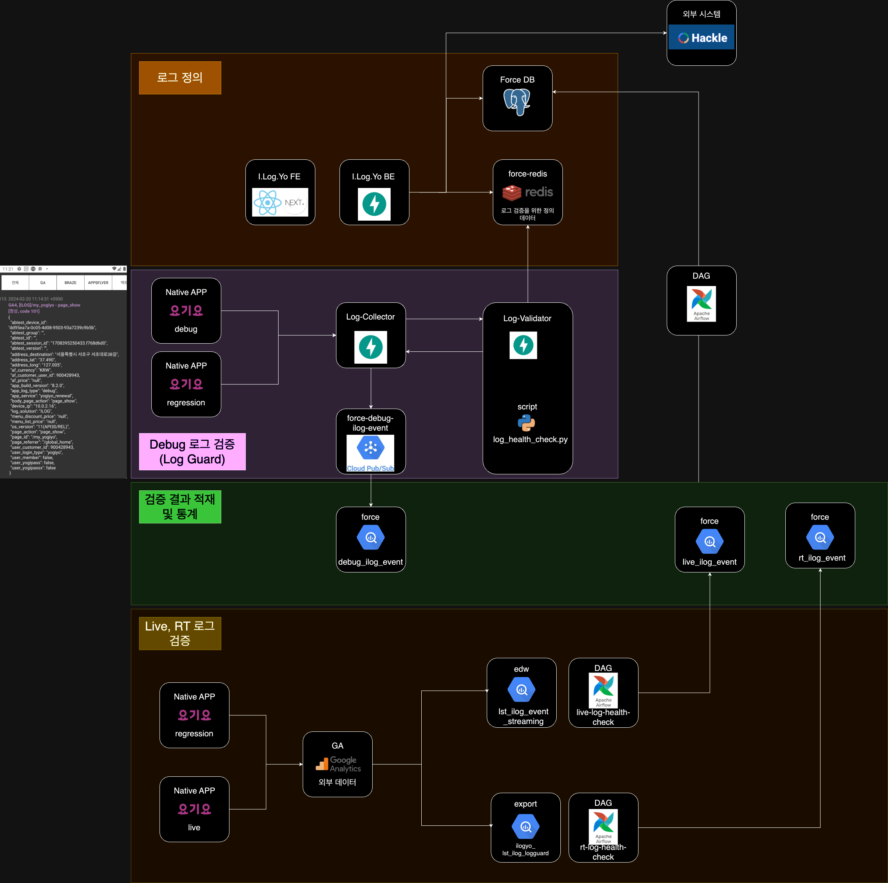

# I.Log.Yo (요기요 사용자 행동 로그 관리, 수집 및 정합성 체크, 로그 분석 통계 서비스)

## Architecture

- I.Log.Yo: 요기요의 다양한 앱(일반 사용자 주문 앱, 라이더 앱, 사장님 앱 등)에서 발생하는 사용자들의 행동 로그를 정의하고, 관리하는 서비스.
    - I.Log.Yo FE (React), I.Log.Yo BE (FastAPI)로 구성
    - 정의된 로그의 최신 데이터가 redis에 캐싱되고, Log-Validator에서 활용합니다.
    - Hackle과 연동하여 정의된 내용을 바탕으로 PO들이 AB 테스트를 상시 실시합니다.
    - 로그 품질과 관련된 다양한 통계를 앱별, 일자별로 조회할 수 있고, 다양한 형태로 시각화하여 제공합니다.
- Log Guard: Debug 앱에서 전송되는 실시간 행동 로그를 적재하고, 정의된 내용과 비교하여 정합성 체크 후 결과를 응답하는 서비스.
    - Log-Collector(로그 적재, FastAPI), Log-Validator(로그 정합성 체크, FastAPI)로 구성
- Log Quality Monitoring: 적재된 로그를 각 환경(Live: 운영 환경, RT: Regression Test/스테이징 환경, Debug: 개발 환경)별로 정의된 내용과 비교하여 정합성을 체크하고, 그 결과를 바탕으로 다양한 통계를 제공하는 서비스.
    - 데이터의 흐름: App -> GA4 -> eDW(BigQuery) -> 통계 처리 시스템(Airflow, GKE, Log-Validator) -> mart(BigQuery)
    - Debug 환경: 앱에서 전송된 로그를 바로 Log-Collector에서 저장하고, Log-Validator에서 정합성을 체크하여 결과를 바로 저장합니다.
    - Live, RT 환경: 앱에서 GA4 뿐만 아니라 다양한 플랫폼에 로그를 동시에 전송합니다. I.Log.Yo에서 화면을 통해 로그별로 어떤 플랫폼에 전송할지 설정합니다. GA4에 전송된 로그는 10분 미만의 시간마다 BigQuery에 있는 eDW에 적재됩니다.
    - 적재된 로그를 통계 처리 시스템을 통해 정합성 체크 결과와 함께 다양한 로그의 품질과 관련된 통계를 만들어냅니다.

## Debug 앱 시연 영상

[시연 영상](../assets/images/ilogyo-debug.mp4){:target="_blank"}