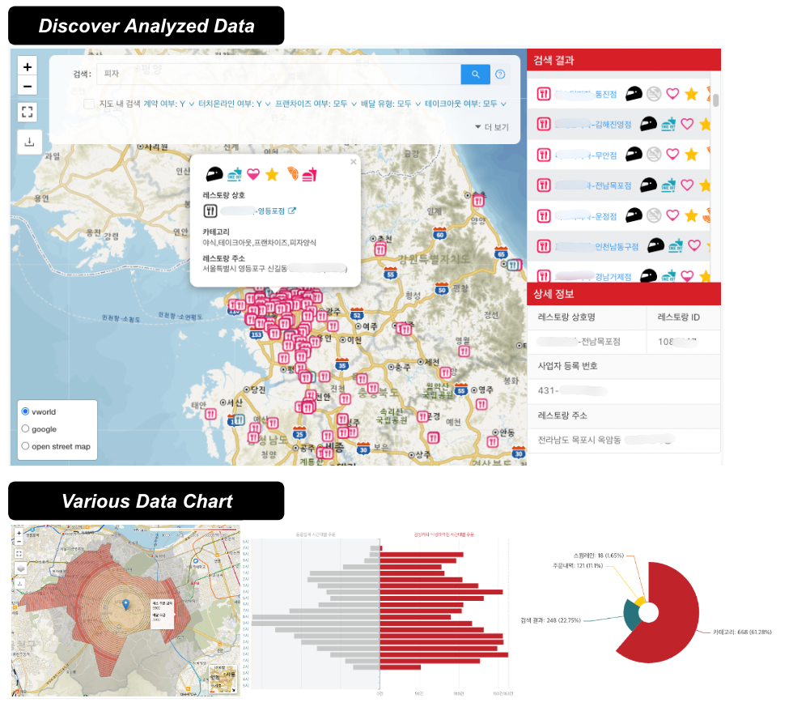

# YoDa (요기요 데이터 시각화 서비스)

## YoDa란?

- Yogiyo Data 를 조회, 분석, 활용할 수 있는 플랫폼
- 가게 컨설팅 등 운영성 업무를 위한 데이터 Insight 및 대시보드 제공
- AI/ML 모델 결과를 활용한 Simulation 및 Insight 제공

## 개발 배경

- 내부 임직원 혹은 사장님 등 데이터를 잘 모르는 사람에게도 분석된 데이터를 활용할 수 있는 시각화된 형태로 제공
- 기존의 시각화 툴은 상세한 개별 프로파일링 정보 제공이나 검색 같은 목적에는 다소 효율성이 떨어짐

## 기대 효과

- MG본부, LE본부 등 운영성 업무를 하는 조직에서 상세한 개별 프로파일링 정보를 바탕으로 보다 효율적인 업무 가능
- 서비스향으로 가공된 Data Asset 를 제공하여 향후 다양한 팀에서 같은 기준의 데이터를 사용할 수 있음

## 주요 기능

- Data Visualization
    - 화면 내 조작을 통한 Interactive한 데이터 시각화
    - Tableau/Looker Studio에서 표현하기 어려운 데이터 시각화
- Data Valuation
    - 데이터를 활용한 2차 Value 생성 (Api, Report 등등)
    - 분석가나 관련 직원들에게 분석된 Data Asset의 제공
- Data Simulation
    - AI/ML 모델 결과를 활용한 Simulation 및 Insight 제공

### Sales Funnel Support

- MG 본부, LE 본부에서 OD 서비스 지역을 확인하고, 영업할 대
상 가게를 선정하는 용도로 사용
- 가맹된 가게의 정보 및 OD Zone별 통계 데이터 제공
- 가장 많은 사용자가 사용 중

#### Provided Zone Data in SFS

- Targetyo에서 설정한 polygon 정보
- 행정동 (포함 면적)
- 유형별 통계 데이터(OD/VD, multi-zone 여부, 프랜차이즈 여부
등)
- 카테고리별 가게 수

### R2D2

- 요기요 사용자가 작성한 리뷰를 이미지/텍스트 분석을 통하여
생성된 메타 데이터 제공
- 욕설, 부적절한 사진, 중복 사진 사용 등의 이유로 검수 및 블라
인드 처리가 필요한 리뷰 탐색 및 백오피스 연결 기능 제공

### Forecasting

- 예측모델(Prophet)을 이용하여 요기요 서비스의 수요/주문을 예측하여 제공